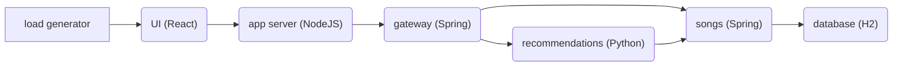

https://skywalking.apache.org/docs/skywalking-showcase/latest/readme/#skywalking-showcase

# SkyWalking示例

​	本示例库包含一个音乐应用以及其他用于展示其他SkyWalking主要特性的示例。音乐应用由几个不同语言编写的微服务组成。下图是音乐应用的架构。



## 使用

​	本实例使用[GNU Make](https://www.gnu.org/software/make/)以及Docker容器来运行环境，所以请确保您已经安装了`make`和运行了`Docker daemon`。

## 前置条件

​	为了部署示例应用的所有特性，你需要准备至少4核心&4GB内存。如果发现容器/Pods启动失败，请增加`Docker Daemon`的资源或者`Kubernetes cluster`的资源。或者你不增加资源，可以仅部署感兴趣的内容(参考[Customization](https://skywalking.apache.org/docs/skywalking-showcase/latest/readme/#customization))。

## 快速开始

​	确保你已经运行了`Kubernetes cluster`并且`kubectl`可以访问cluster。

```sh
git clone https://github.com/apache/skywalking-showcase.git
cd skywalking-showcase
make deploy.kubernetes
```

​	以上命令将会安装SkyWalking的组件，包括两个OAP集群节点，`SkyWalking RocketBot UI`, 携带`SkyWalking agent`运行的微服务，不携带`SkyWalking agent`但是通过Istio管理的微服务， 两个模仿虚拟机的Pods并且暴露其指标给SkyWalking， 以及启动`kubernetes`集群监控以及SkyWalking本身的监控。

​	如果想了解更高级的部署方式，请参考下文的 [Customization](https://skywalking.apache.org/docs/skywalking-showcase/latest/readme/#customization)

​	注意，当本地运行示例(比如`KinD`), 可能会花10分钟以上(取决于本地网络)的时间去下载镜像到`KinD`里面。如果有超时的错误，请重新运行`make deploy.kubernetes`。

## 自定义

​	可以通过指定和`Makefile.in`中相同的环境变量来自定义示例:

```sh
export ES_VERSION=7.14.0
make <target>
```

​	或者在`make`指令中指定变量, 比如

​	`make <target> ES_VERSION=7.14.0`。

​	可以运行`make help`来获取帮助。

## 特性

​	本示例由一组携带特性标记的场景组成，你可以通过重写`FEATURE_FLAGS`(定义在[`Makefile.in`](https://github.com/apache/skywalking-showcase/tree/3ee8f9923e29c542996735464949fd002a31fa70/Makefile.in)中)来部署感兴趣的特性场景。比如:

```sh
make deploy.kubernetes FEATURE_FLAGS=single-node,agent
```

​	不同平台(([Kubernetes](https://skywalking.apache.org/docs/skywalking-showcase/latest/readme/#kubernetes) and [Docker Compose](https://skywalking.apache.org/docs/skywalking-showcase/latest/readme/#docker-compose))的特性标记不一定相同，请确保指定正确的特性标记。

​	目前，支持的特性有:

| 名称                 | 描述                                                         | 备注                                                         |
| -------------------- | ------------------------------------------------------------ | ------------------------------------------------------------ |
| `agent`              | 部署开启了SkyWalking agent的微服务                           | 包含了Java, NodeJS server, browser, Python agent的微服务     |
| `cluster`            | 部署双集群 SkyWalking OAP节点,以及SkyWalking RocketBot UI, 还部署了ElasticSearch作为存储 | `cluster` 和 `single-node` 互斥，只能有一个开启。            |
| `single-node`        | 部署单 SkyWalking OAP节点,以及SkyWalking RocketBot UI, 还部署了ElasticSearch作为存储 | `cluster` 和 `single-node` 互斥，只能有一个开启。            |
| `so11y`              | 启用 SkyWalking自身监控                                      | [Docker Compose](https://skywalking.apache.org/docs/skywalking-showcase/latest/readme/#docker-compose)中默认启用 |
| `vm`                 | 开启2两个虚拟机并且 暴露metrics给 SkyWalking.                | "虚拟机"实际是Docker containers 或者 Pods。                  |
| `als`                | 部署开启了无SkyWalking agent的微服务, 并且配置 SkyWalking通过日志拓扑图和metrics | 这个特性需要`istioctl` 。 agentless 微服务会影响在`${NAMESPACE}-agentless`命名空间下 |
| `kubernetes-monitor` | Deploy OpenTelemetry and export Kubernetes monitoring metrics to SkyWalking for analysis and display on UI. |                                                              |
| `istiod-monitor`     | 部署 OpenTelemetry 并且暴露Istio 控制面板 metrics给SkyWalking, 用分析并展示在界面上。 |                                                              |
| `event`              | 部署工具来触发事件,并且SkyWalking Kubernetes event exporter会暴露事件给SkyWalking. |                                                              |

## Kubernetes

​	为了在Kubernetes部署示例应用, 请确保`kubectl`命令可以运行,并且可以成功连接Kubernetes集群.

​	如果你还没有运行Kubernetes 集群, 你可以利用 [KinD (Kubernetes in Docker)](https://kind.sigs.k8s.io/) 或 [minikube](https://minikube.sigs.k8s.io/) 来创建集群。

​	 在进行下一步之前，可以用`kubectl get nodes`来检查网络连接。 表明`kubectl`无法连接到集群的典型错误信息如下:

```text
The connection to the server localhost:8080 was refused - did you specify the right host or port?
```

## Docker Compose

### 部署

```shell
# Deploy
make deploy.docker
# Undeploy
make undeploy.docker
# Redeploy
make redeploy.docker # equivalent to make undeploy.docker deploy.docker
```

