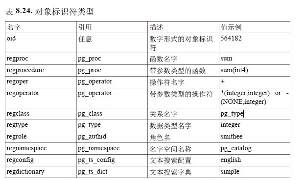

```sql
create database test03 encoding 'UTF8' lc_collate 'en_US.utf8' lc_ctype 'en_US.utf8'  template template0;


CREATE TABLE weather (
	city varchar(80),
	temp_lo int, -- 最低温度
	temp_hi int, -- 最高温度
	prcp real, -- 湿度
	date date
);
DROP TABLE weather;
INSERT INTO weather VALUES ('San Francisco', 46, 50, 0.25, '1994-11-27');

# 视图
CREATE VIEW myview AS
SELECT city, temp_lo, temp_hi, prcp, date, location
FROM weather, cities
WHERE city = name;

# 外键
CREATE TABLE weather (
city varchar(80) references cities(city),
temp_lo int,
temp_hi int,
prcp real,
date date
);

# 事务
BEGIN;
UPDATE accounts SET balance = balance - 100.00
WHERE name = 'Alice';
-- etc etc
COMMIT;

# 保存点
BEGIN;
UPDATE accounts SET balance = balance - 100.00
WHERE name = 'Alice';
SAVEPOINT my_savepoint;
UPDATE accounts SET balance = balance + 100.00
WHERE name = 'Bob';
-- oops ... forget that and use Wally's account
ROLLBACK TO my_savepoint;
UPDATE accounts SET balance = balance + 100.00
WHERE name = 'Wally';
COMMIT;

# 窗口函数
# 下面是一个例子用于展示如何将每一个员工的薪水与他/她所在部门的平均薪水进行比较：
SELECT depname, empno, salary, avg(salary) OVER (PARTITION BY depname) FROM
empsalary;

# 我们可以通过OVER上的ORDER BY控制窗口函数处理行的顺序（窗口的ORDER BY并不一
# 定要符合行输出的顺序。）。下面是一个例子：
SELECT depname, empno, salary,
rank() OVER (PARTITION BY depname ORDER BY salary DESC) FROM empsalary;
```


```sql
SELECT salary, sum(salary) OVER () FROM empsalary;
```


由于在OVER子句中没有ORDER BY，窗口帧和分区一样，而如果缺
少PARTITION BY则和整个表一样。换句话说，每个合计都会在整个表上进行，这样我们为
每一个输出行得到的都是相同的结果。但是如果我们加上一个ORDER BY子句，我们会得到
非常不同的结果：


```sql
# 这里的合计是从第一个（最低的）薪水一直到当前行，包括任何与当前行相同的行（注意相
# 同薪水行的结果）。
SELECT salary, sum(salary) OVER (ORDER BY salary) FROM empsalary;
salary | sum
--------+-------
3500 | 3500
3900 | 7400
4200 | 11600
4500 | 16100
4800 | 25700
4800 | 25700
5000 | 30700
5200 | 41100
5200 | 41100
6000 | 47100
```

# 继承

在PostgreSQL中，一个表可以从0个或者多个表继承。

```java
CREATE TABLE cities (
name text,
population real,
altitude int -- (in ft)
);
CREATE TABLE capitals (
state char(2)
) INHERITS (cities);
```

# SQL

## unicode

`U&'d\0061t\+000061'`

如果想要一个不是反斜线的转义字符，可以在字符串之后使用UESCAPE子句来指定，例
如：
`U&'d!0061t!+000061'UESCAPE'!'`

## 美元引用的字符串常量

注意在美元引用字符串中，单引号可以在不被转义的情况下使用。事实上，在一个美元引用
字符串中不需要对字符进行转义：字符串内容总是按其字面意思写出。

```
$$Dianne's horse$$
```

## 其他类型常量

一种任意类型的一个常量可以使用下列记号中的任意一种输入：
type 'string'
'string'::type
CAST ( 'string' AS type )

## 注释

一段注释是以双斜线开始并且延伸到行结尾的一个字符序列，例如：
`-- This is a standard SQL comment`
另外，也可以使用 C 风格注释块：

```
/* multiline comment
* with nesting: /* nested block comment */
*/
```

## 操作优先级


## 下标

如果一个表达式得到了一个数组类型的值，那么可以抽取出该数组值的一个特定元素：
`expression[subscript]`
或者抽取出多个相邻元素（一个“数组切片”）：
`expression[lower_subscript:upper_subscript]`

## 操作符调用

对于一次操作符调用，有三种可能的语法：
`expression operator expression`（二元中缀操作符）
`operator expression`（一元前缀操作符）
`expression operator`（一元后缀操作符）
其中operator记号遵循第 4.1.3 节的语法规则，或者是关键词AND、OR和NOT之一，或者是
一个如下形式的受限定操作符名：
`OPERATOR(schema.operatorname)`
哪个特定操作符存在以及它们是一元的还是二元的取决于由系统或用户定义的那些操作
符。第 9 章描述了内建操作符。


```
SELECT
count(*) AS unfiltered,
count(*) FILTER (WHERE i < 5) AS filtered
FROM generate_series(1,10) AS s(i);
```

## 类型转换

```sql
CAST ( expression AS type )
expression::type
```

## 数组构造器

```sql
SELECT ARRAY[1,2,3+4];

SELECT ARRAY[1,2,22.7]::integer[];
```

## 行构造器

当在列表中有超过一个表达式时，关键词ROW是可选的。

```sql
SELECT ROW(1,2.5,'this is a test');
```

# 数据定义

## 默认值

```sql
CREATE TABLE products (
product_no integer,
name text,
price numeric DEFAULT 9.99
);

# 序列号
CREATE TABLE products (
product_no integer DEFAULT nextval('products_product_no_seq'),
...
);

# 这里nextval()函数从一个序列对象第 9.16 节）。还有一种特别的速写：
CREATE TABLE products (
product_no SERIAL,
...
);

# 检查约束
CREATE TABLE products (
product_no integer,
name text,
price numeric CHECK (price > 0)
);
# 我们也可以给与约束一个独立的名称。这会使得错误消息更为清晰，同时也允许我们在需要
# 更改约束时能引用它。语法为：
CREATE TABLE products (
product_no integer,
name text,
price numeric CONSTRAINT positive_price CHECK (price > 0)
);

#一个检查约束也可以引用多个列。例如我们存储一个普通价格和一个打折后的价格，而我们
# 希望保证打折后的价格低于普通价格：
CREATE TABLE products (
product_no integer,
name text,
price numeric CHECK (price > 0),
discounted_price numeric CHECK (discounted_price > 0),
CHECK (price > discounted_price)
);

# 表约束也可以用列约束相同的方法来指定名称：
CREATE TABLE products (
product_no integer,
name text,
price numeric,
CHECK (price > 0),
discounted_price numeric,
CHECK (discounted_price > 0),
CONSTRAINT valid_discount CHECK (price > discounted_price)
);
```

## 非空约束

```sql
CREATE TABLE products (
product_no integer NOT NULL,
name text NOT NULL,
price numeric
);
```

NOT NULL约束有一个相反的情况：NULL约束。这并不意味着该列必须为空，进而肯定是
无用的。相反，它仅仅选择了列可能为空的默认行为。SQL标准中并不存在NULL约束，因此
它不能被用于可移植的应用中（PostgreSQL中加入它是为了和某些其他数据库系统兼容）。

但是某些用户喜欢它，因为它使得在一个脚本文件中可以很容易的进行约束切换。例如，初
始时我们可以：

```sql
CREATE TABLE products (
product_no integer NULL,
name text NULL,
price numeric NULL
);
```

## 唯一约束

```sql
CREATE TABLE products (
	product_no integer UNIQUE,
	name text,
	price numeric
);

CREATE TABLE products (
	product_no integer,
	name text,
	price numeric,
	UNIQUE (product_no)
);

CREATE TABLE example (
	a integer,
	b integer,
	c integer,
	UNIQUE (a, c)
);

# 我们可以通常的方式为一个唯一索引命名：
CREATE TABLE products (
product_no integer CONSTRAINT must_be_different UNIQUE,
name text,
price numeric
);

```

## 主键

```sql
CREATE TABLE products (
product_no integer UNIQUE NOT NULL,
name text,
price numeric
);
CREATE TABLE products (
product_no integer PRIMARY KEY,
name text,
price numeric
);

CREATE TABLE example (
a integer,
b integer,
c integer,
PRIMARY KEY (a, c)
);
```

## 外键

```sql
CREATE TABLE orders (
order_id integer PRIMARY KEY,
product_no integer REFERENCES products (product_no),
quantity integer
);

CREATE TABLE t1 (
a integer PRIMARY KEY,
b integer,
c integer,
FOREIGN KEY (b, c) REFERENCES other_table (c1, c2)
);
```

​	我们知道外键不允许创建与任何产品都不相关的订单。但如果一个产品在一个引用它的订单
创建之后被移除会发生什么？SQL允许我们处理这种情况。直观上，我们有几种选项：

```sql
CREATE TABLE order_items (
product_no integer REFERENCES products ON DELETE RESTRICT,
order_id integer REFERENCES orders ON DELETE CASCADE,
quantity integer,
PRIMARY KEY (product_no, order_id)
);
```

​	限制删除或者级联删除是两种最常见的选项。

​	与ON DELETE相似，同样有ON UPDATE可以用在一个被引用列被修改（更新）的情况，可
选的动作相同。在这种情况下，CASCADE意味着被引用列的更新值应该被复制到引用行
中。

## 修改表

```sql
ALTER TABLE products ADD COLUMN description text;
ALTER TABLE products ADD COLUMN description text CHECK (description <> '');
ALTER TABLE products DROP COLUMN description;
#列中的数据将会消失。涉及到该列的表约束也会被移除。然而，如果该列被另一个表的外键
#所引用，PostgreSQL不会安静地移除该约束。我们可以通过增加CASCADE来授权移除任何
#依赖于被删除列的所有东西：
ALTER TABLE products DROP COLUMN description CASCADE;

ALTER TABLE products ADD CHECK (name <> '');
ALTER TABLE products ADD CONSTRAINT some_name UNIQUE (product_no);
ALTER TABLE products ADD FOREIGN KEY (product_group_id) REFERENCES
 product_groups;
# 要增加一个不能写成表约束的非空约束，可使用语法：
ALTER TABLE products ALTER COLUMN product_no SET NOT NULL;
ALTER TABLE products DROP CONSTRAINT some_name;
ALTER TABLE products ALTER COLUMN product_no DROP NOT NULL;

ALTER TABLE products ALTER COLUMN price SET DEFAULT 7.77;
ALTER TABLE products ALTER COLUMN price DROP DEFAULT;

ALTER TABLE products ALTER COLUMN price TYPE numeric(10,2);

ALTER TABLE products RENAME COLUMN product_no TO product_number;
ALTER TABLE products RENAME TO items;


```

## 权限

有多种不同的权
限：SELECT、INSERT、UPDATE、DELETE、TRUNCATE、REFERENCES、TRIGGER、CREATE、CONNECT及USAGE。可以应用于一个特定对象的权限随着对象的类型（表、函数等）而不
同。PostgreSQL所支持的不同类型的完整权限信息请参考GRANT。下面的章节将简单介绍
如何使用这些权限。

要分配权限，可以使用GRANT命令。例如，如果joe是一个已有角色，而accounts是一个已有
表，更新该表的权限可以按如下方式授权：

```
GRANT UPDATE ON accounts TO joe;
```

用ALL取代特定权限会把与对象类型相关的所有权限全部授权。

为了撤销一个权限，使用REVOKE命令：

```
REVOKE ALL ON accounts FROM PUBLIC;
```

## 行安全策略

当在一个表上启用行安全性时（使用 ALTER TABLE ... ENABLE ROW LEVEL SECURITY），所有对该表选择行或者修改行的普通访问都必须被一条 行安全性策略所允许（不过，表的拥有者通常不服从行安全性策略）。如果 表上不存在策略，将使用一条默认的否定策略，即所有的行都不可见或者不能 被修改。应用在整个表上的操作不服从行安全性，例如TRUNCATE和 REFERENCES。

作为一个简单的例子，这里是如何在account关系上 创建一条策略以允许只有managers角色的成员能访问行， 并且只能访问它们账户的行：

```sql
CREATE TABLE accounts (manager text, company text, contact_email text);
ALTER TABLE accounts ENABLE ROW LEVEL SECURITY;
CREATE POLICY account_managers ON accounts TO managers
USING (manager = current_user);

```

如果没有指定角色或者使用了特殊的用户名PUBLIC， 则该策略适用于系统上所有的用户。
要允许所有用户访问users 表中属于他们自己的行，可以使用一条简单的策略：

```sql
CREATE POLICY user_policy ON users
USING (user_name = current_user);
```

要对相对于可见行是被增加到表中的行使用一条不同的策略，可以使用 WITH CHECK子句。这条策略将允许所有用户查看 users表中的所有行，但是只能修改它们自己的行：

```sql
CREATE POLICY user_policy ON users
USING (true)
WITH CHECK (user_name = current_user);
```

## 模式

```sql
CREATE SCHEMA myschema;
CREATE TABLE myschema.mytable (
...
);
DROP SCHEMA myschema;
# 要删除一个模式以及其中包含的所有对象，可用：
DROP SCHEMA myschema CASCADE;

#我们常常希望创建一个由其他人所拥有的模式（因为这是将用户动作限制在良定义的名字空
间中的方法之一）。其语法是：
CREATE SCHEMA schema_name AUTHORIZATION user_name;
```

​	在前面的小节中，我们创建的表都没有指定任何模式名称。默认情况下这些表（以及其他对象）会自动的被放入一个名为“public”的模式中。任何新数据库都包含这样一个模式。因此，下面的命令是等效的：

## 模式搜索路径

要显示当前搜索路径，使用下面的命令：
SHOW search_path;
在默认设置下这将返回：

```sql
search_path

"$user",public
```

第一个元素说明一个和当前用户同名的模式会被搜索。如果不存在这个模式，该项将被忽略。第二个元素指向我们已经见过的公共模式。

```sql
#要把新模式放在搜索路径中，我们可以使用：
SET search_path TO myschema,public;
#（我们在这里省略了$user，因为我们并不立即需要它）。然后我们可以该表而
#无需使用模式限定：
DROP TABLE mytable;
```

## 模式和权限

默认情况下，用户不能访问不属于他们的模式中的任何对象。要允许这种行为，模式的拥有者必须在该模式上授予USAGE权限。为了允许用户使用模式中的对象，可能还需要根据对象授予额外的权限。

## 系统目录模式

​	除public和用户创建的模式之外，每一个数据库还包括一个pg_catalog模式，它包含了系统表和所有内建的数据类型、函数以及操作符。pg_catalog总是搜索路径的一个有效部分。如果没有在路径中显式地包括该模式，它将在路径中的模式之前被搜索。这保证了内建的名称总是能被找到。然而，如果我们希望用用户定义的名称重载内建的名称，可以显式的将pg_catalog放在搜索路径的末尾。

## 表分区

PostgreSQL为以下形式的分区提供了内置支持：
**范围分区**
	该表被分区到由键列或列集定义的“范围”中， 分配给不同分区的值范围之间没有重叠。例如，可以按日期范围进行分区， 也可以按特定业务对象的标识符范围进行分区。
**列表分区**
	表通过明确列出每个分区中出现的键值进行分区。


1.通过声明PARTITION BY子句将 measurement表创建为分区表， 它包括分区方法（该例中是RANGE） 和要用作分区键的字段。

```sql
CREATE TABLE measurement (
city_id int not null,
logdate date not null,
peaktemp int,
unitsales int
) PARTITION BY RANGE (logdate);
```

2.创建分区

```sql
CREATE TABLE measurement_y2006m02 PARTITION OF measurement
FOR VALUES FROM ('2006-02-01') TO ('2006-03-01')
CREATE TABLE measurement_y2006m03 PARTITION OF measurement
FOR VALUES FROM ('2006-03-01') TO ('2006-04-01')

...
CREATE TABLE measurement_y2007m11 PARTITION OF measurement
FOR VALUES FROM ('2007-11-01') TO ('2007-12-01')
CREATE TABLE measurement_y2007m12 PARTITION OF measurement
FOR VALUES FROM ('2007-12-01') TO ('2008-01-01')
TABLESPACE fasttablespace;

CREATE TABLE measurement_y2008m01 PARTITION OF measurement
FOR VALUES FROM ('2008-01-01') TO ('2008-02-01')
TABLESPACE fasttablespace
WITH (parallel_workers = 4);
```

要实现子分区，在创建单个分区的语句中声明PARTITION BY 子句，例如：

```sql
CREATE TABLE measurement_y2006m02 PARTITION OF measurement
FOR VALUES FROM ('2006-02-01') TO ('2006-03-01')
PARTITION BY RANGE (peaktemp);
```

3. 对于每一个分区，在键列上创建索引，以及您可能需要的其他索引。

```sql
CREATE INDEX ON measurement_y2006m02 (logdate);
CREATE INDEX ON measurement_y2006m03 (logdate);
...
CREATE INDEX ON measurement_y2007m11 (logdate);
CREATE INDEX ON measurement_y2007m12 (logdate);
CREATE INDEX ON measurement_y2008m01 (logdate);
```

4. 确保在postgresql.conf中constraint_exclusion配置参数没有被禁用。如果它被禁用，查询将
不会被按照期望的方式优化。

在上面的例子中，我们将每个月创建一个新的分区， 所以编写一个脚本可以自动生成所需的
DDL。

# 数据操纵

## 从修改行中返回数据

```sql
UPDATE products SET price = price * 1.10
WHERE price <= 99.99
RETURNING name, price AS new_price;

DELETE FROM products
WHERE obsoletion_date = 'today'
RETURNING *;
```

# 查询

## 表表达式

### LATERAL子查询

​	可以在出现于FROM中的子查询前放置关键词LATERAL。这允许它们引用前面的FROM项提
供的列（如果没有LATERAL，每一个子查询将被独立计算，并且因此不能被其他FROM项
交叉引用）。

​	如果一个FROM项包含LATERAL交叉引用，计算过程如下：对于提供交叉引用列的FROM项
的每一行，或者多个提供这些列的多个FROM项的行集合，LATERAL项将被使用该行或者
行集中的列值进行计算。得到的结果行将和它们被计算出来的行进行正常的连接。对于来自
这些列的源表的每一行或行集，该过程将重复。

```sql
SELECT * FROM foo, LATERAL (SELECT * FROM bar WHERE bar.id = foo.bar_id) ss;
```

这不是非常有用，因为它和一种更简单的形式得到的结果完全一样：

```sql
SELECT * FROM foo, bar WHERE bar.id = foo.bar_id;
```

### GROUPING SETS、CUBE和ROLLUP


## 组合查询

两个查询的结果可以用集合操作并、交、差进行组合。语法是

```sql
query1 UNION [ALL] query2
query1 INTERSECT [ALL] query2
query1 EXCEPT [ALL] query2
```


## LIMIT和OFFSET

```sql
SELECT select_list
FROM table_expression
[ ORDER BY ... ]
[ LIMIT { number | ALL } ] [ OFFSET number ]
```

## VALUES列表

VALUES提供了一种生成“常量表”的方法，它可以被使用在一个查询中而不需要实际在磁
盘上创建一个表。语法是：

```sql
VALUES ( expression [, ...] ) [, ...]
```

每一个被圆括号包围的表达式列表生成表中的一行。列表都必须具有相同数据的元素（即表
中列的数目），并且在每个列表中对应的项必须具有可兼容的数据类型。分配给结果的每一
列的实际数据类型使用和UNION相同的规则确定（参见第 10.5 节）。
一个例子：

```sql
VALUES (1, 'one'), (2, 'two'), (3, 'three');
```

将会返回一个有两列三行的表。它实际上等效于：

```sql
SELECT 1 AS column1, 'one' AS column2
UNION ALL
SELECT 2, 'two'
UNION ALL
SELECT 3, 'three';
```

## WITH查询（公共表表达式）

### WITH中的SELECT

```sql
WITH regional_sales AS (
SELECT region, SUM(amount) AS total_sales
FROM orders
GROUP BY region
), top_regions AS (
SELECT region
FROM regional_sales
WHERE total_sales > (SELECT SUM(total_sales)/10 FROM regional_sales)
)
SELECT region,
product,
SUM(quantity) AS product_units,
SUM(amount) AS product_sales
FROM orders
WHERE region IN (SELECT region FROM top_regions)
GROUP BY region, product;
```

## 递归查询

```sql
# 想下递归
WITH RECURSIVE r AS (
    SELECT * FROM public.crm_sys_menu WHERE id = v_pid
    union ALL
    SELECT public.crm_sys_menu.* FROM public.crm_sys_menu, r WHERE public.crm_sys_menu.p_id = r.id
)
select * from r;
```


1. 计算非递归项。对UNION（但不对UNION ALL），抛弃重复行。把所有剩余的行包括
   在递归查询的结果中，并且也把它们放在一个临时的工作表中。

2. 只要工作表不为空，重复下列步骤：
a. 计算递归项，用当前工作表的内容替换递归自引用。对UNION（不是UNION
ALL），抛弃重复行以及那些与之前结果行重复的行。将剩下的所有行包括在递归
查询的结果中，并且也把它们放在一个临时的中间表中。
b. 用中间表的内容替换工作表的内容，然后清空中间表。

## WITH中的数据修改语句

你可以在WITH中使用数据修改语句（INSERT、UPDATE或DELETE）。这允许你在同一个
查询中执行多个而不同操作。一个例子：

```sqk
WITH moved_rows AS (
DELETE FROM products
WHERE
"date" >= '2010-10-01' AND
"date" < '2010-11-01'
RETURNING *
)
INSERT INTO products_log
SELECT * FROM moved_rows;
```

​	这个查询实际上从products把行移动到products_log。WITH中的DELETE删除来自products的指定行，以它的RETURNING子句返回它们的内容，并且接着主查询读该输出并将它插入到products_log。

一个非特殊使用的例子：

```sql
WITH t AS (
DELETE FROM foo
)
DELETE FROM bar;
```

这个例子将从表foo和bar中移除所有行。被报告给客户端的受影响行的数目可能只包括从bar中移除的行。

# 数据类型


## 数字类型


### 序列整形

```sql
CREATE TABLE tablename (
colname SERIAL
);
# 等价于以下语句：
CREATE SEQUENCE tablename_colname_seq;
CREATE TABLE tablename (
colname integer NOT NULL DEFAULT nextval('tablename_colname_seq')
);
ALTER SEQUENCE tablename_colname_seq OWNED BY tablename.colname;
```

> **注意**
>
> 因为smallserial、serial和bigserial是用序列实现的，所以即使没有删除过行，在出现在列中的序列值可能有“空洞”或者间隙。如果一个从序列中分配的值被用在一行中，即使该行最终没有被成功地插入到表中，该值也被“用掉”了。例如，当插入事务回滚时就会发生这种情况。更多信息参见第 9.16 节中的nextval()。

## 货币类型


## 字符类型


## 二进制数据类型


### bytea的逃逸格式


## 日期/时间类型


​	SQL要求只写timestamp等效于timestamp without time zone，并且PostgreSQL鼓励这种行为。timestamptz被接受为timestamp with time zone的一种简写，这是一种PostgreSQL的扩展。

​	time、timestamp和interval接受一个可选的精度值 p，这个精度值声明在秒域中小数点之后保留的位数。缺省情况下，在精度上没有明确的边界，p允许的范围是从 0 到6。

​	interval类型有一个附加选项，它可以通过写下面之一的短语来限制存储的fields的集合：
YEAR
MONTH
DAY
HOUR
MINUTE
SECOND
YEAR TO MONTH
DAY TO HOUR
DAY TO MINUTE
DAY TO SECOND
HOUR TO MINUTE
HOUR TO SECOND
MINUTE TO SECOND


类型time with time zone是 SQL 标准定义的，但是该定义显示出了一些会影响可用性的性质。在大多数情况下， date、time、timestamp without time zone和timestamp with time zone的组合就应该能提供任何应用所需的全范围的日期/时间功能。

### 日期


### 时间


### 时间戳


### 特殊值


### 日期/时间输出


### 间隔输入


## 布尔类型


## 枚举类型

### 枚举类型的声明

枚举类型可以使用CREATE TYPE命令创建，例如：

```sql
CREATE TYPE mood AS ENUM ('sad', 'ok', 'happy');
```

一旦被创建，枚举类型可以像很多其他类型一样在表和函数定义中使用：

```sql
CREATE TYPE mood AS ENUM ('sad', 'ok', 'happy');
CREATE TABLE person (
name text,
current_mood mood
);
INSERT INTO person VALUES ('Moe', 'happy');
SELECT * FROM person WHERE current_mood = 'happy';
name | current_mood
------+--------------
Moe | happy
(1 row)
```

### 排序

一个枚举类型的值的排序是该类型被创建时所列出的值的顺序。枚举类型的所有标准的比较操作符以及相关聚集函数都被支持。例如：

```sql
INSERT INTO person VALUES ('Larry', 'sad');
INSERT INTO person VALUES ('Curly', 'ok');
SELECT * FROM person WHERE current_mood > 'sad';
name | current_mood
-------+--------------
Moe | happy
Curly | ok
(2 rows)
SELECT * FROM person WHERE current_mood > 'sad' ORDER BY current_mood;
name | current_mood
-------+--------------
Curly | ok
Moe | happy
(2 rows)
SELECT name
FROM person
WHERE current_mood = (SELECT MIN(current_mood) FROM person);
name
-------
Larry
(1 row)
```

### 类型安全性

每一种枚举数据类型都是独立的并且不能和其他枚举类型相比较。看这样一个例子：

```sql
CREATE TYPE happiness AS ENUM ('happy', 'very happy', 'ecstatic');
CREATE TABLE holidays (
num_weeks integer,
happiness happiness
);
INSERT INTO holidays(num_weeks,happiness) VALUES (4, 'happy');
INSERT INTO holidays(num_weeks,happiness) VALUES (6, 'very happy');
INSERT INTO holidays(num_weeks,happiness) VALUES (8, 'ecstatic');
INSERT INTO holidays(num_weeks,happiness) VALUES (2, 'sad');
ERROR: invalid input value for enum happiness: "sad"
SELECT person.name, holidays.num_weeks FROM person, holidays
```

## 几何类型


## 网络地址类型


## 位串类型

位串就是一串 1 和 0 的串。它们可以用于存储和可视化位掩码。我们有两种类型的 SQL 位类型：bit(n)和bit varying(n)，其中 n是一个正整数。

```sql
CREATE TABLE test (a BIT(3), b BIT VARYING(5));
INSERT INTO test VALUES (B'101', B'00');
INSERT INTO test VALUES (B'10', B'101');
ERROR: bit string length 2 does not match type bit(3)
INSERT INTO test VALUES (B'10'::bit(3), B'101');
SELECT * FROM test;
```

## 文本搜索类型

​	PostgreSQL提供两种数据类型，它们被设计用来支持全文搜索，全文搜索是一种在自然语言的文档集合中搜索以定位那些最匹配一个查询的文档的活动。tsvector类型表示一个为文本搜索优化的形式下的文档，tsquery类型表示一个文本查询。第 12 章提供了对于这种功能的详细解释，并且第 9.13 节总结了相关的函数和操作符。

### tsvector

​	一个tsvector值是一个排序的可区分词位的列表，词位是被正规化合并了同一个词的不同变种的词（详见第 12 章）。排序和去重是在输入期间自动完成的，如下例所示：

```sql
SELECT 'a fat cat sat on a mat and ate a fat rat'::tsvector;
tsvector
----------------------------------------------------
'a' 'and' 'ate' 'cat' 'fat' 'mat' 'on' 'rat' 'sat'
```

```sql
# 要表示包含空白或标点的词位，将它们用引号包围：
SELECT $$the lexeme ' ' contains spaces$$::tsvector;
tsvector
-------------------------------------------
' ' 'contains' 'lexeme' 'spaces' 'the'
```

### tsquery

一个tsquery值存储要用于搜索的词位，并且使用布尔操作符&（AND）、|（OR）和!（NOT）来组合它们，还有短语搜索操作符`<->`（FOLLOWED BY）。也有一种 FOLLOWED BY 操作符的变体`<N>`，其中N是一个整数常量，它指定要搜索的两个词位之间的距离。`<->`等效于`<1>`。

```sql
SELECT 'fat & rat'::tsquery;
tsquery
---------------
'fat' & 'rat'
SELECT 'fat & (rat | cat)'::tsquery;
tsquery
---------------------------
'fat' & ( 'rat' | 'cat' )
SELECT 'fat & rat & ! cat'::tsquery;
tsquery
------------------------
'fat' & 'rat' & !'cat'
```

## UUID类型


## XML类型

​	xml数据类型可以被用来存储XML数据。它比直接在一个text域中存储XML数据的优势在于，它会检查输入值的结构是不是良好，并且有支持函数用于在其上执行类型安全的操作，参见第 9.14 节。使用这种数据类型要求在安装时用configure --with-libxml选项编译。

### 创建XML值


## JSON 类型

​	有两种 JSON 数据类型：json 和 jsonb。它们 几乎接受完全相同的值集合作为输入。主要的实际区别之一是 效率。json数据类型存储输入文本的精准拷贝，处理函数必须在每 次执行时必须重新解析该数据。而jsonb数据被存储在一种分解好的 二进制格式中，它在输入时要稍慢一些，因为需要做附加的转换。但是 jsonb在处理时要快很多，因为不需要解析。jsonb也支持索引，这也是一个令人瞩目的优势。

​	通常，除非有特别特殊的需要（例如遗留的对象键顺序假设），大多数应用应该 更愿意把JSON 数据存储为jsonb。

​	PostgreSQL对每个数据库只允许一种 字符集编码。因此 JSON 类型不可能严格遵守 JSON 规范，除非数据库编码 是 UTF8。尝试直接包括数据库编码中无法表示的字符将会失败。反过来，能在数据库编码中表示但是不在 UTF8 中的字符是被允许的。


### jsonb 索引

GIN 索引可以被用来有效地搜索在大量jsonb文档（数据）中出现 的键或者键值对。提供了两种 GIN “操作符类”，它们在性能和灵活 性方面做出了不同的平衡。


## 数组

```sql
CREATE TABLE sal_emp (
name text,
pay_by_quarter integer[],
schedule text[][]
);
# CREATE TABLE的语法允许指定数组的确切大小，例如：
CREATE TABLE tictactoe (
squares integer[3][3]
);

```

​	然而，当前的实现忽略任何提供的数组尺寸限制，即其行为与未指定长度的数组相同。

​	当前的实现也不会强制所声明的维度数。一个特定元素类型的数组全部被当作是相同的类型，而不论其尺寸或维度数。因此，在CREATE TABLE中声明数组的尺寸或维度数仅仅只是文档而已，它并不影响运行时的行为。

另一种符合SQL标准的语法是使用关键词ARRAY，可以用来定义一维数组。pay_by_quarter可以这样定义：

```
pay_by_quarter integer ARRAY[4],
```

或者，不指定数组尺寸：

```sql
pay_by_quarter integer ARRAY,
```

但是和前面一样，PostgreSQL在任何情况下都不会强制尺寸限制。

### 数组值输入

```sql
'{ val1 delim val2 delim ... }'
'{{1,2,3},{4,5,6},{7,8,9}}'

INSERT INTO sal_emp
VALUES ('Bill',
'{10000, 10000, 10000, 10000}',
'{{"meeting", "lunch"}, {"training", "presentation"}}');
```

### 访问数组

现在，我们可以在该表上运行一些查询。首先，我们展示如何访问一个数组中的一个元素。下面的查询检索在第二季度工资发生变化的雇员的名字：

```sql
SELECT name FROM sal_emp WHERE pay_by_quarter[1] <> pay_by_quarter[2];

SELECT schedule[1:2][2] FROM sal_emp WHERE name = 'Bill';
```

`如果数组本身为空或者任何一个下标表达式为空，访问数组下标表达式将会返回空值。如果下标超过了数组边界，下标表达式也会返回空值（这种情况不会抛出错误）。例如，如果schedule目前具有的维度是

```
[1:3][1:2]
```

，那么引用`schedule[3][3]`将得到NULL。相似地，使用错误的下标号引用一个数组会得到空值而不是错误。

任何数组值的当前维度可以使用array_dims函数获得：

```sql
SELECT array_dims(schedule) FROM sal_emp WHERE name = 'Carol';
array_dims
------------
[1:2][1:2]
(1 row)
```

array_length将返回一个指定数组维度的长度：

```sql
SELECT array_length(schedule, 1) FROM sal_emp WHERE name = 'Carol';
```

cardinality返回一个数组中在所有维度上的元素总数。 这实际上是调用unnest将会得到的行数：

```sql
SELECT cardinality(schedule) FROM sal_emp WHERE name = 'Carol';
cardinality
-------------
4
(1 row)
```

### 修改数组

```sql
# 一个数组值可以被整个替换：
UPDATE sal_emp SET pay_by_quarter = '{25000,25000,27000,27000}'
WHERE name = 'Carol';
# 或者使用ARRAY表达式语法：
UPDATE sal_emp SET pay_by_quarter = ARRAY[25000,25000,27000,27000]
WHERE name = 'Carol';
# 一个数组也可以在一个元素上被更新：
UPDATE sal_emp SET pay_by_quarter[4] = 15000
WHERE name = 'Bill';
# 或者在一个切片上被更新：
UPDATE sal_emp SET pay_by_quarter[1:2] = '{27000,27000}'
WHERE name = 'Carol';
# 也可以使用省略lower-bound或者 upper-bound的切片语法，但是只能用于 更新一个不是NULL 或者零维的数组值（否则无法替换现有的下标界线）。

# 新的数组值也可以通过串接操作符||构建：
SELECT ARRAY[1,2] || ARRAY[3,4];
?column?
-----------
{1,2,3,4}
(1 row)

SELECT ARRAY[5,6] || ARRAY[[1,2],[3,4]];
?column?
---------------------
{{5,6},{1,2},{3,4}}
(1 row)
```

串接操作符允许把一个单独的元素加入到一个一维数组的开头或末尾。它也能接受两个N维数组，或者一个N维数组和一个N+1维数组。

```sql
# 当一个单独的元素被加入到一个一维数组的开头或末尾时，其结果是一个和数组操作数具有相同下界下标的新数组。例如：
SELECT array_dims(1 || '[0:1]={2,3}'::int[]);
array_dims
------------
[0:2]
(1 row)
SELECT array_dims(ARRAY[1,2] || 3);
array_dims
------------
[1:3]
(1 row)
# 当两个具有相同维度数的数组被串接时，其结果保留左操作数的外维度的下界下标。结果将是一个数组，它由左操作数的每一个元素以及紧接着的右操作数的每一个元素。例如：
SELECT array_dims(ARRAY[1,2] || ARRAY[3,4,5]);
array_dims
------------
[1:5]
(1 row)
SELECT array_dims(ARRAY[[1,2],[3,4]] || ARRAY[[5,6],[7,8],[9,0]]);
array_dims
------------
[1:5][1:2]
(1 row)
当一个N维数组被放在另一个N+1维数组的前面或者后面时，结果和上面的例子相似。每一
个N维子数组实际上是N+1维数组外维度的一个元素。例如：
SELECT array_dims(ARRAY[1,2] || ARRAY[[3,4],[5,6]]);
array_dims
------------
[1:3][1:2]
(1 row)
一个数组也可以通过使用函数array_prepend、array_append或array_cat构建。前两个函数仅支
持一维数组，但array_cat支持多维数组。 一些例子：
SELECT array_prepend(1, ARRAY[2,3]);
array_prepend
---------------
{1,2,3}
(1 row)
SELECT array_append(ARRAY[1,2], 3);
array_append
--------------
{1,2,3}
(1 row)
SELECT array_cat(ARRAY[1,2], ARRAY[3,4]);
array_cat
-----------
{1,2,3,4}
(1 row)
SELECT array_cat(ARRAY[[1,2],[3,4]], ARRAY[5,6]);
array_cat
---------------------
{{1,2},{3,4},{5,6}}
(1 row)
SELECT array_cat(ARRAY[5,6], ARRAY[[1,2],[3,4]]);
array_cat
---------------------
{{5,6},{1,2},{3,4}}
```

```sql
SELECT ARRAY[1, 2] || '{3, 4}'; -- 没有指定类型的文字被当做一个数组
?column?
-----------
{1,2,3,4}
SELECT ARRAY[1, 2] || '7'; -- 这个也是
ERROR: malformed array literal: "7"
SELECT ARRAY[1, 2] || NULL; -- 未修饰的 NULL 也是如此
?column?
----------
{1,2}
(1 row)
SELECT array_append(ARRAY[1, 2], NULL); -- 这可能才是想要的意思
array_append
--------------
{1,2,NULL}
```

### 在数组中搜索

```sql
SELECT * FROM sal_emp WHERE pay_by_quarter[1] = 10000 OR
pay_by_quarter[2] = 10000 OR
pay_by_quarter[3] = 10000 OR
pay_by_quarter[4] = 10000;

SELECT * FROM sal_emp WHERE 10000 = ANY (pay_by_quarter);

# 此外，我们还可以查找所有元素值都为10000的数组所在的行：
SELECT * FROM sal_emp WHERE 10000 = ALL (pay_by_quarter);
# 另外，generate_subscripts函数也可以用来完成类似的查找。例如：
SELECT * FROM
(SELECT pay_by_quarter,
generate_subscripts(pay_by_quarter, 1) AS s
FROM sal_emp) AS foo
WHERE pay_by_quarter[s] = 10000;
```

我们也可以使用&&操作符来搜索一个数组，它会检查左操作数是否与右操作数重叠。例如：

```sql
SELECT * FROM sal_emp WHERE pay_by_quarter && ARRAY[10000];
```

​	你也可以使用array_position和array_positions在一个 数组中搜索特定值。前者返回值在数组中第一次出现的位置的下标。后者返回一个数组， 其中有该值在数组中的所有出现位置的下标。例如：

```sql
SELECT array_position(ARRAY['sun','mon','tue','wed','thu','fri','sat'], 'mon');
array_positions
-----------------
2
SELECT array_positions(ARRAY[1, 4, 3, 1, 3, 4, 2, 1], 1);
array_positions
-----------------
{1,4,8}
```

> 数组不是集合，在其中搜索指定数组元素可能是数据设计失误的表现。考虑使用一个独立的表来替代，其中每一行都对应于一个数组元素。这将更有利于搜索，并且对于大量元素的可扩展性更好。

## 复合类型

​	一个复合类型表示一行或一个记录的结构，它本质上就是一个域名和它们数据类型的列表。PostgreSQL允许把复合类型用在很多能用简单类型的地方。例如，一个表的一列可以被声明为一种复合类型。

### 复合类型的声明

```sql
CREATE TYPE complex AS (
r double precision,
i double precision
);
CREATE TYPE inventory_item AS (
name text,
supplier_id integer,
price numeric
);
```

该语法堪比CREATE TABLE，不过只能指定域名和类型，当前不能包括约束（例如NOT NULL）。注意AS关键词是必不可少的，如果没有它，系统将认为用户想要的是一种不同类 型的CREATE TYPE命令，并且你将得到奇怪的语法错误。

定义了类型之后，我们可以用它们来创建表：

```sql
CREATE TABLE on_hand (
item inventory_item,
count integer
);

INSERT INTO on_hand VALUES (ROW('fuzzy dice', 42, 1.99), 1000);
# or functions:
CREATE FUNCTION price_extension(inventory_item, integer) RETURNS numeric
AS 'SELECT $1.price * $2' LANGUAGE SQL;
```

### 构造组合值

```sql
'( val1 , val2 , ... )'
'("fuzzy dice",42,1.99)'
```

这将是上文定义的inventory_item类型的一个合法值。要让一个域为 NULL，在列表中它的位置上根本不写字符。例如，这个常量指定其第三个域为 NULL：

```sql
'("fuzzy dice",42,)'
```

如果你写一个空字符串而不是 NULL，写上两个引号：

```sql
'("",42,)'  
```

### 访问复合类型

```sql
SELECT item.name FROM on_hand WHERE item.price > 9.99;
SELECT (item).name FROM on_hand WHERE (item).price > 9.99;
SELECT (on_hand.item).name FROM on_hand WHERE (on_hand.item).price > 9.99;
```

### 修改复合类型

```sql
INSERT INTO mytab (complex_col) VALUES((1.1,2.2));
UPDATE mytab SET complex_col = ROW(1.1,2.2) WHERE ...;
UPDATE mytab SET complex_col.r = (complex_col).r + 1 WHERE ...;
INSERT INTO mytab (complex_col.r, complex_col.i) VALUES(1.1, 2.2);
```

### 在查询中使用复合类型

​	在PostgreSQL中，在查询中引用表名（或别名） 是对该表的当前行的复合类型的有效引用。例如，如果我们有下面这样一个表 inventory_item：

```sql
SELECT c FROM inventory_item c;
```

​	不过请注意，简单名称首先匹配列名然后再匹配表名， 所以这个示例能有效是因为查询表中没有列的名字为c。

## 范围类型

​	范围类型是表达某种元素类型（称为范围的subtype）的一个值的范围的数据类型。例如，timestamp的范围可以被用来表达一个会议室被保留的时间范围。在这种情况下，数据类型是tsrange（“timestamp range”的简写）而timestamp是 subtype。subtype 必须具有一种总体的顺序，这样对于元素值是在一个范围值之内、之前或之后就是界线清楚的。

### 内建范围类型

PostgreSQL 带有下列内建范围类型：
• int4range — integer的范围
• int8range — bigint的范围
• numrange — numeric的范围
• tsrange — 不带时区的 timestamp的范围
• tstzrange — 带时区的 timestamp的范围
• daterange — date的范围
此外，你可以定义自己的范围类型，详见CREATE TYPE。

### 例子

```sql
CREATE TABLE reservation (room int, during tsrange);
INSERT INTO reservation VALUES
(1108, '[2010-01-01 14:30, 2010-01-01 15:30)');
-- 包含
SELECT int4range(10, 20) @> 3;
-- 重叠
SELECT numrange(11.1, 22.2) && numrange(20.0, 30.0);
-- 抽取上界
SELECT upper(int8range(15, 25));
-- 计算交集
SELECT int4range(10, 20) * int4range(15, 25);
-- 范围为空吗？
SELECT isempty(numrange(1, 5));
```

### 包含和排除边界

​	每一个非空范围都有两个界限，下界和上界。这些值之间的所有点都被包括在范围内。一个包含界限意味着边界点本身也被包括在范围内，而一个排除边界意味着边界点不被包括在范围内。

### 无限（无界）范围

​	一个范围的下界可以被忽略，意味着所有小于上界的点都被包括在范围中。同样，如果范围的上界被忽略，那么所有比上界大的的都被包括在范围中。如果上下界都被忽略，该元素类型的所有值都被认为在该范围中。

### 范围输入/输出

一个范围值的输入必须遵循下列模式之一：

```sql
(lower-bound,upper-bound)
(lower-bound,upper-bound]
[lower-bound,upper-bound)
[lower-bound,upper-bound]
empty
 
 -- 包括 3，不包括 7，并且包括 3 和 7 之间的所有点
SELECT '[3,7)'::int4range;
-- 既不包括 3 也不包括 7，但是包括之间的所有点
SELECT '(3,7)'::int4range;
-- 只包括单独一个点 4
SELECT '[4,4]'::int4range;
-- 不包括点（并且将被标准化为 '空'）
SELECT '[4,4)'::int4range;
```

### 构造范围

```sql
-- 完整形式是：下界、上界以及指示界限包含性/排除性的文本参数。
SELECT numrange(1.0, 14.0, '(]');
-- 如果第三个参数被忽略，则假定为 '[)'。
SELECT numrange(1.0, 14.0);
-- 尽管这里指定了 '(]'，显示时该值将被转换成标准形式，因为 int8range 是一种离散范围类型（见下文）。
SELECT int8range(1, 14, '(]');
-- 为一个界限使用 NULL 导致范围在那一边是无界的。
SELECT numrange(NULL, 2.2);
```

### 离散范围类型

​	一种范围的元素类型具有一个良定义的“步长”，例如integer或date。在这些类型中，如果两个元素之间没有合法值，它们可以被说成是相邻。这与连续范围相反，连续范围中总是（或者几乎总是）可以在两个给定值之间标识其他元素值。例如，numeric类型之上的一个范围就是连续的，timestamp上的范围也是（尽管timestamp具有有限的精度，并且在理论上可以被当做离散的，最好认为它是连续的，因为通常并不关心它的步长）。

### 定义新的范围类型

```sql
CREATE TYPE floatrange AS RANGE (
subtype = float8,
subtype_diff = float8mi
);
SELECT '[1.234, 5.678]'::floatrange;
```

因为float8没有有意义的“步长”，我们在这个例子中没有定义一个正规化函数。

### 索引

```sql
# 可以为范围类型的表列创建 GiST 和 SP-GiST 索引。例如，要创建一个 GiST 索引：
CREATE INDEX reservation_idx ON reservation USING GIST (during);
# 一个 GiST 或 SP-GiST 索引可以加速涉及以下范围操作符的查询： =、 &&、 <@、 @>、<<、 >>、 -|-、 &<以及 &> （详见表 9.50）。
```

### 范围上的约束

​	虽然UNIQUE是标量值的一种自然约束，它通常不适合于范围类型。反而，一种排除约束常常更加适合（见CREATE TABLE ... CONSTRAINT ... EXCLUDE）。排除约束允许在一个范围类型上说明诸如“non-overlapping”的约束。例如：

```sql
CREATE TABLE reservation (
during tsrange,
EXCLUDE USING GIST (during WITH &&)
);
```

该约束将阻止任何重叠值同时存在于表中：

## 对象标识符类型

​	对象标识符（OID）被PostgreSQL用来在内部作为多个系统表的主键。OID不会被添加到用户创建的表中，除非在创建表时指定了WITH OIDS或者default_with_oids配置变量被启用。类型oid表示一个对象标识符。也有多个oid的别名类型：regproc、regprocedure、regoper、regoperator、regclass、regtype、regrole、regnames8p.2ac4e显、regconfig和regdictionary示了一个概览。


​	OID的别名类型除了特定的输入和输出例程之外没有别的操作。这些例程可以接受并显示系统对象的符号名，而不是类型oid使用的原始数字值。别名类型使查找对象的OID值变得简单。例如，要检查与一个表mytable有关的pg_attribute行，你可以写：

```sql
SELECT * FROM pg_attribute WHERE attrelid = 'mytable'::regclass;
```



## pg_lsn Type

​	pg_lsn数据类型可以被用来存储 LSN（日志序列号）数据，LSN 是一个指向 WAL 中的位置的指针。这个类型是XLogRecPtr的一种表达并且是 PostgreSQL的一种内部系统类型。

​	在内部，一个 LSN 是一个 64 位整数，表示在预写式日志流中的一个字节位置。它被打印成两个最高 8 位的十六进制数，中间用斜线分隔，例如16/B374D848。 pg_lsn类型支持标准的比较操作符，如=和 >。两个 LSN 可以用-操作符做减法， 结果将是分隔两个预写式日志位置的字节数。

## 伪类型


