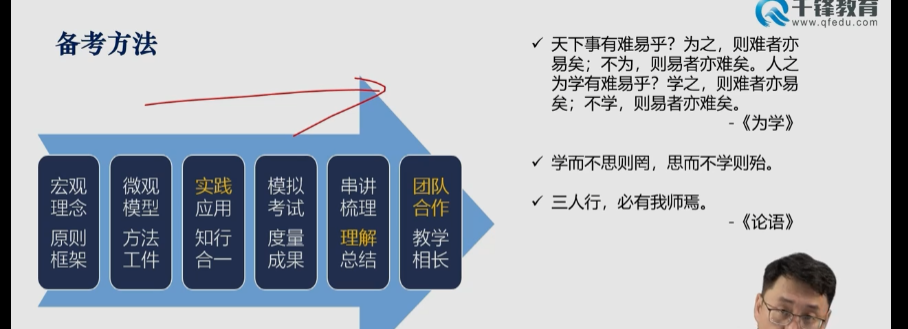

学习课程地址：https://edk.h5.xeknow.com/s/39qXLF

# 题目

体系+敏捷1-30语音解析：

1-10：https://edk.h5.xeknow.com/s/2N2IFU

11-20：https://edk.h5.xeknow.com/s/3FpU1m

21-30：https://edk.h5.xeknow.com/s/28BNwD

精讲阶段练习：https://edk.h5.xeknow.com/s/17mraI群内每周五发的PDF题目弄成了在线的，想每天做题的直接在这里做，想周末一次性做完的等待每周五发PDF即可~

# 学习计划

千锋教育-ITTO

https://docs.qq.com/sheet/DWkNYTVFtS0VPc1BT

【腾讯文档】PMP项目管理-复习重点思维导图
https://docs.qq.com/pdf/DWVNoc3hwWXRwckFZ?

# 考纲2021

以人、流程、商业环境为考试重点。

计划型/瀑布型: 以计划做管理。(1/2题)

怎么做计划，怎么通过计划做监控。

敏捷管理：agile，计划是基础，做变化，适应变化。(1/2题)。

混合管理(hybird): 狭义就是计划+敏捷。

**考试形式**

180题，10-15个多选(会告诉有几个正确答案)，没有填空。

中英文混合

## 备考方案

项目管理概述1-28:20

# 项目管理概述

## 起源

金字塔、长城、曼哈顿计划、登月计划。

项目都有开始和结束时间。

## 发展

4 + 2

4: 尊重、责任、公正、诚实。

2: 国家大法、企业小法

本方和对方的都需要尊重，有冲突向上汇报

### PMP引入中国

## 核心概念和术语

项目是为创造独特的产品、服务或成果而进行的临时性工作。

* 临时性 是指项目有明确的起点和终点。
* 独特性 独特的产品、服务或成果。
* 渐进名字
* 项目驱动改革。

因为前三个特点，风险才高。

### 项目驱动变革

### 项目的启动和终止

在以下一种或多种情况下，项目即宣告结束：

■　达成项目目标；

■　不会或不能达到目标；

■　资金耗尽或再无可分配给项目的资金；

■　项目需求不复存在（例如，客户不再要求完成项目，战略或优先级的变更致使项目终止，组织管理层下达终止项目的指示）；

■　无法获得所需人力或物力资源；

■　出于法律或便利原因而终止项目。

完成后，移交成果。

如果失败，要启动调查程序，总结失败教训

### 运营的定义

在相对封闭和确定的环境下开展的重复性的、周而复始的、持续性的活动：

* 常规性
* 环境相对封闭
* 重复性。

### 项目和运营的不同点

### 项目和运营的交互

### 项目管理的定义

* 项目管理是管理学的一个分支学科。
* 项目管理就是将知识、技能、工具与技术应用于项目活动，以产出可交付成果及达到项目目标，项目成功是在竞争性制约因素下实现预期的商业价值。

### 生命周期

### 项目阶段及阶段关口

### 阶段之间的关系

### Cynefin (肯尼芬) 框架复杂性模型

### 预测型(瀑布型)生命周期

### 迭代和增量

### 迭代型

### 增量型

### 敏捷型

* 迭代敏捷 scrum
* 基于流程的敏捷 看板法
* sp
* safe

### 适应型生命周期

特别适合互联网产品。

### 项目生成周期的特征

### 生命周期的连续区间

### 通用生命周期特点

### 需求评估与关键业务/项目文件的相互管理

### 项目目标

SMART

* S：明确的
* M：可测量的
* A：可实现的
* R：相关联的
* T：有时限的

### 项目成果标准

### 项目运行环境

#### 事业环境因素

### 组织过程资产

DIKW模型

data、information、knowledge、wisdom

### ppp项目的比较概述

### 项目组合、项目集、项目和运营之间的关系

### 项目治理

### PMO

### 组织治理

### 组织结构

#### 系统型/简单型组织

#### 职能型组织

#### 弱矩阵

### 均衡矩阵

谈判

#### 强矩阵

#### 项目导向型组织

#### 虚拟组织

多地分布

#### 多部门型

#### 混合型

#### 组织架构区别

### 组织级项目管理(OPM)和战略

项目和公司战略要契合。

### 使命、愿景、价值观

### 项目、组织与战略规划

SWOT矩阵

### 项目管理与组织

	

**示例**

### 相关方/干系人

#### 管理的五项基本职能

组织、计划、协调、控制、领导

### PM能力模型

#### 领导思维

**Think Bigger**

#### 领导力风格

### 组织变革的障碍

### 应对组织变革

### 管理和领导力

### 项目职权的种类

### 项目经理的人际关系影响

### 项目合规管理定义

# 项目管理体系

## 项目管理的五大过程组

## 过程组的相互作用

## 项目边界

## 启动过程组定义

## 启动过程组任务

## 制定项目章程

#### 项目选择指标

#### 成本消息分析法	

##### 净现值-NPV

##### 内部报酬率

##### 投资回报率-ROI

##### 效益成本比- BCR

##### 回收期-PBP

##### 输入:项目协议

##### 工具与技术:会议管理

## 识别相关方

#### 输出：相关方/干系人登记册

#### 工具与技术: 相关方分析

#### 工具与技术: 相关方映射分析/表现

#### 合同类型

## 规划过程组

#### 规划过程组任务

#### 项目不确定性和复杂性

#### 数据流向图-4.2制定项目管理计划

#### 项目管理计划组成

#### 项目管理计划和项目文件

#### 需求分类

#### 质量功能展开图QFD

#### 创建WBS

#### 规划进度管理

#### 定义活动

#### 排序活动顺序

#### 估算活动资源

#### 估算活动持续时间

#### 制定进度计划

#### 成本类型

## 质量管理

### 规划质量管理

## 规划资源管理

